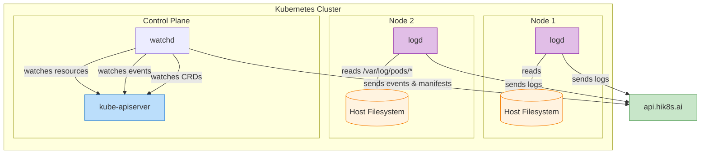

# Hik8s agents

This repository contains agents that need to be run in your cluster to run Hik8s:

- [rs/logd/README.md](./rs/logd/README.md) (log daemon)

## Local development

The code in this program is specific to Linux and requires a development container to be compiled on macOS. To do this, we create a Docker image and run a container from this image in which the relevant files are mounted as volumes:

1. Build the image

    ```bash
    IMAGE_NAME="hik8s/agents-dev-container"
    docker build -t $IMAGE_NAME -f Dockerfile.dev .
    ```

2. Run a container

    ```bash
    IMAGE_NAME="hik8s/agents-dev-container"
    WORKDIR=$(grep 'WORKDIR' Dockerfile.dev | awk '{print $2}') && echo $WORKDIR

    docker run -it \
    --volume "$(pwd)/rs:$WORKDIR/rs" \
    --volume "$(pwd)/Cargo.toml:$WORKDIR/Cargo.toml" \
    --volume "$(pwd)/.env:$WORKDIR/.env" \
    $IMAGE_NAME
    ```

3. Inside the container, run:

    ```bash
    cargo watch -x run
    ```

This runs logd and recompiles when you make changes in your IDE.

## System diagram

The main components are log-daemon and wathch-daemon. This is how they interact with your Kubernetes cluster:


